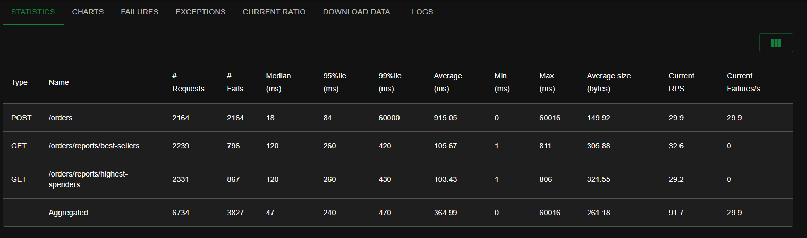
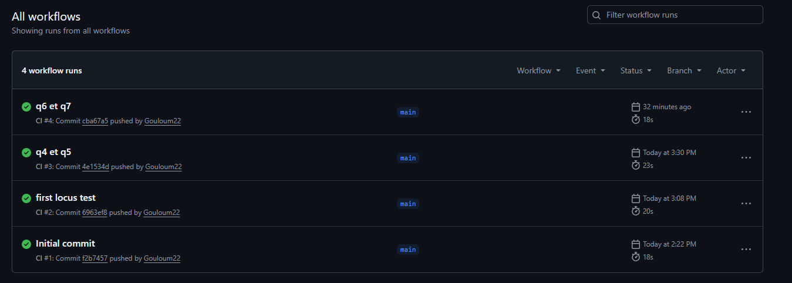
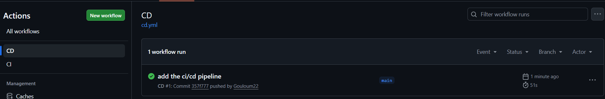
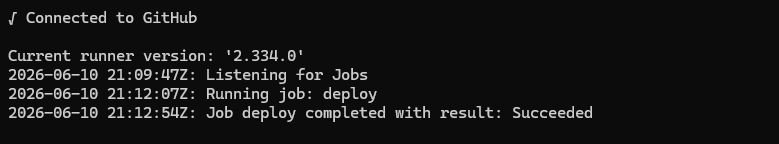

Dyaa Abou Arida

# Rapport Labo 4

**Question 1 : Combien d'utilisateurs faut-il pour que le Store Manager commence à échouer dans votre environnement de test ? Pour répondre à cette question, comparez la ligne Failures et la ligne Users dans les graphiques.**

Le Store Manager commence à échouer autour de 146 utilisateurs simultanés, la ligne des échecs commence à augmenter de façon visible.

1.1 Capture d'écran de Charts

---------------------------------------
**Question 2 : Sur l'onglet Statistics, comparez la différence entre les requêtes et les échecs pour tous les endpoints. Combien d'entre eux échouent plus de 50 % du temps ?**

Le endpoint POST /orders échoue 100% du temps, tandis que les deux endpoints de rapports échouent environ 67% du temps.

2.1 Capture d'écran des statistiques

---------------------------------------
**Question 3 : Affichez quelques exemples des messages d'erreur affichés dans l'onglet Failures. Ces messages indiquent une défaillance dans quelle(s) partie(s) du Store Manager ? Par exemple, est-ce que le problème vient du service Python / MySQL / Redis / autre ?**

Les erreurs indiquent principalement une défaillance au niveau de MySQL. On observe des erreurs Too many connections, ce qui signifie que la base de données reçoit trop de connexions simultanées.

3.1 Capture d'écran des failures

---------------------------------------
**Question 4 : Sur l'onglet Statistics, comparez les résultats actuels avec les résultats du test de charge précédent. Est-ce que vous voyez quelques différences dans les métriques pour l'endpoint POST /orders ?**

Après l’optimisation du problème N+1, je ne constate pas d’amélioration significative pour l’endpoint POST /orders. L’endpoint continue d’échouer 100% du temps. Les métriques montrent que le temps de réponse reste très élevé. Cela indique que le problème principal ne vient pas uniquement de la récupération des prix des produits, mais surtout de la surcharge de MySQL lors des écritures simultanées.

4.1 Capture d'écran des statistiques

---------------------------------------
**Question 5 : Si nous avions plus d'articles dans notre base de données (par exemple, 1 million), ou simplement plus d'articles par commande en moyenne, le temps de réponse de l'endpoint POST /orders augmenterait-il, diminuerait-il ou resterait-il identique ?**

Si la base de données contenait plus d’articles le temps de réponse ne devrait pas nécessairement augmenter beaucoup pour chercher les produits par id parce que cette recherche est indexée. Par contre, si chaque commande contenait plus d’articles en moyenne, le temps de réponse de POST /orders augmenterait parce que l’application devrait traiter plus d’items, calculer plus de prix, insérer plus de lignes OrderItem et mettre à jour plus de stocks. 

---------------------------------------
**Question 6 : Sur l'onglet Statistics, comparez les résultats actuels avec les résultats du test de charge précédent. Est-ce que vous voyez quelques différences significatives dans les métriques pour les endpoints POST /orders, GET /orders/reports/highest-spenders et GET /orders/reports/best-sellers ? Dans quelle mesure la performance s'est-elle améliorée ou détériorée (par exemple, en pourcentage) ?**

Après l’implémentation du cache Redis optimisé, les performances des endpoints de lecture se sont fortement améliorées. Après l’optimisation, best-sellers a seulement 2 échecs sur 690 requêtes, soit environ 0,29%, et highest-spenders a 4 échecs sur 727 requêtes, soit environ 0,55%. Les deux endpoints de rapports deviennent donc presque entièrement disponibles sous charge.

Par contre, l’endpoint POST /orders ne s’améliore pas. Il échoue encore 100% du temps, avec 736 échecs sur 736 requêtes. Cela montre que l’optimisation du cache améliore surtout la lecture des rapports, mais ne règle pas les problèmes d’écriture liés à MySQL.

6.1 Capture d'écran des statistiques

---------------------------------------
**Question 7 : La génération de rapports repose désormais entièrement sur des requêtes adressées à Redis, ce qui réduit la charge pesant sur MySQL. Cependant, le point de terminaison POST /orders reste à la traîne par rapport aux autres en termes de performances dans notre scénario de test. Alors, qu'est-ce qui limite les performances de l'endpoint POST /orders ?**

Les performances de POST /orders sont limitées par MySQL. Contrairement aux rapports, la création d’une commande nécessite encore plusieurs écritures synchrones : création de la commande, insertion des items, mise à jour du stock et transaction SQL. Sous forte charge, cela cause trop de connexions. Redis améliore donc les lectures, mais ne règle pas le problème des écritures concurrentes dans MySQL.

---------------------------------------
**Question 8 : Sur l'onglet Statistics, comparez les résultats actuels avec les résultats du test de charge précédent. Est-ce que vous voyez quelques différences significatives dans les métriques pour les endpoints POST /orders, GET /orders/reports/highest-spenders et GET /orders/reports/best-sellers ? Dans quelle mesure la performance s'est-elle améliorée ou détériorée (par exemple, en pourcentage) ? La réponse dépendra de votre environnement d'exécution (par exemple, vous obtiendrez de meilleures performances en exécutant 2 instances de Store Manager sur 2 machines virtuelles plutôt que sur une seule).**

Avec le load balancing Nginx, le système traite beaucoup plus de requêtes au total, soit environ 6734 requêtes contre 2153 au test précédent, ce qui représente une augmentation d’environ 213%.

Par contre, la fiabilité se détériore. Les endpoints de rapports avaient presque 0% d’échec avant Nginx, alors qu’ils montent à environ 35–37% d’échec avec Nginx. Pour POST /orders, le taux d’échec reste à 100%, donc le load balancing ne règle pas le problème principal.

8.1 Capture d'écran des statistiques

---------------------------------------
**Question 9 : Dans le fichier nginx.conf, il existe un attribut qui configure l'équilibrage de charge. Quelle politique d'équilibrage de charge utilisons-nous actuellement ? Consultez la documentation officielle de Nginx si vous avez des questions.**

La politique d’équilibrage de charge utilisée est least_conn, c’est-à-dire la stratégie des moindres connexions. Avec cette stratégie, Nginx envoie les nouvelles requêtes vers l’instance backend qui a le moins de connexions actives au moment de la requête.

## CI/CD

Intégration continue avec les tests: 

Déploiement continue sur la VM:

