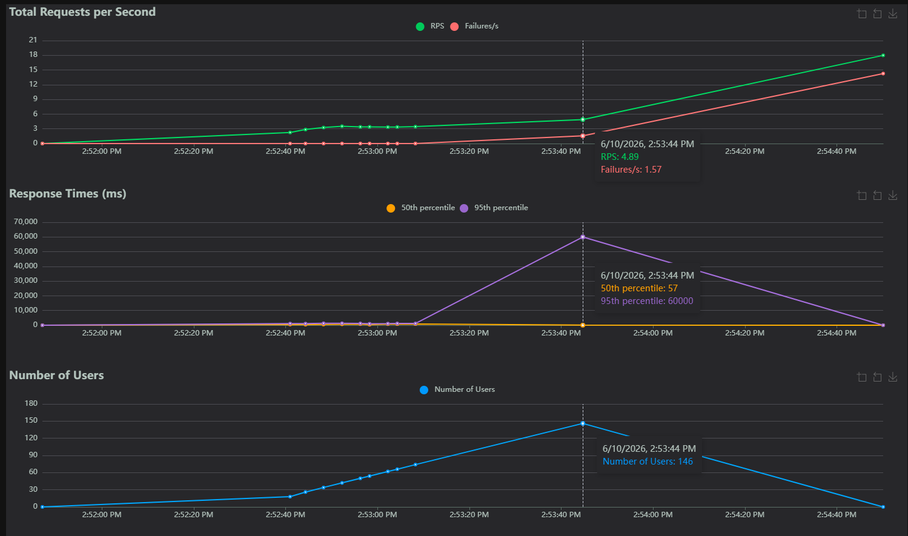
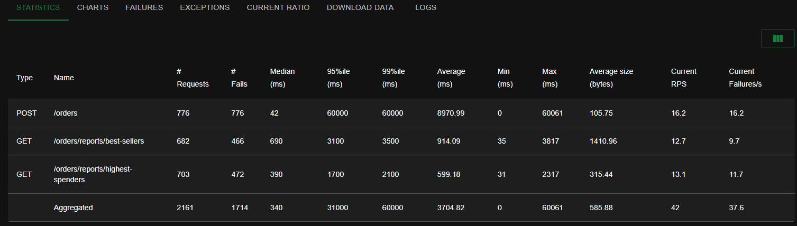
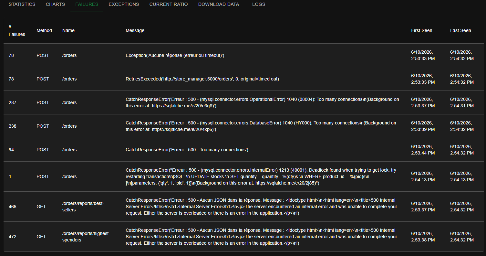
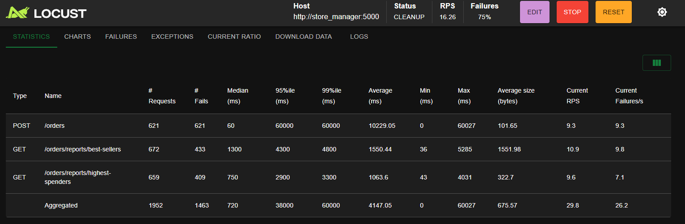
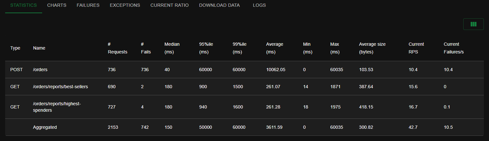

Dyaa Abou Arida

# Rapport Labo 4

**Question 1 : Combien d'utilisateurs faut-il pour que le Store Manager commence à échouer dans votre environnement de test ? Pour répondre à cette question, comparez la ligne Failures et la ligne Users dans les graphiques.**

Dans mon environnement de test, le Store Manager commence à échouer autour de 140 utilisateurs simultanés. À environ 146 utilisateurs, la ligne des échecs commence à augmenter de façon visible.

1.1 Capture d'écran de Charts

---------------------------------------
**Question 2 : Sur l'onglet Statistics, comparez la différence entre les requêtes et les échecs pour tous les endpoints. Combien d'entre eux échouent plus de 50 % du temps ?**

Les trois endpoints testés échouent plus de 50% du temps. Le endpoint POST /orders échoue même 100% du temps, tandis que les deux endpoints de rapports échouent environ 67% du temps.

2.1 Capture d'écran des statistiques

---------------------------------------
**Question 3 : Affichez quelques exemples des messages d'erreur affichés dans l'onglet Failures. Ces messages indiquent une défaillance dans quelle(s) partie(s) du Store Manager ? Par exemple, est-ce que le problème vient du service Python / MySQL / Redis / autre ?**

Les erreurs indiquent principalement une défaillance au niveau de MySQL. On observe des erreurs Too many connections, ce qui signifie que la base de données reçoit trop de connexions simultanées. On observe aussi au moins un deadlock lors de la mise à jour du stock. Le service Python retourne ensuite des erreurs 500, mais ces erreurs semblent causées par la surcharge ou les blocages au niveau de MySQL.

3.1 Capture d'écran des failures

---------------------------------------
**Question 4 : Sur l'onglet Statistics, comparez les résultats actuels avec les résultats du test de charge précédent. Est-ce que vous voyez quelques différences dans les métriques pour l'endpoint POST /orders ?**

Après l’optimisation du problème N+1, je ne constate pas d’amélioration significative pour l’endpoint POST /orders. L’endpoint continue d’échouer 100% du temps dans mon environnement de test. Les métriques montrent que le temps de réponse reste très élevé, avec un 95e percentile à 60 000 ms. Cela indique que le problème principal ne vient pas uniquement de la récupération des prix des produits, mais surtout de la surcharge de MySQL lors des écritures concurrentes, notamment les connexions trop nombreuses, les verrous et les délais d’attente

4.1 Capture d'écran des statistiques

---------------------------------------
**Question 5 : Si nous avions plus d'articles dans notre base de données (par exemple, 1 million), ou simplement plus d'articles par commande en moyenne, le temps de réponse de l'endpoint POST /orders augmenterait-il, diminuerait-il ou resterait-il identique ?**

Si la base de données contenait plus d’articles, par exemple 1 million, le temps de réponse ne devrait pas nécessairement augmenter beaucoup pour chercher les produits par id, car cette recherche est généralement indexée. Par contre, si chaque commande contenait plus d’articles en moyenne, le temps de réponse de POST /orders augmenterait, car l’application devrait traiter plus d’items, calculer plus de prix, insérer plus de lignes OrderItem et mettre à jour plus de stocks. L’optimisation N+1 réduit le nombre de requêtes SQL de lecture, mais elle ne règle pas le coût des écritures et des mises à jour concurrentes.

---------------------------------------
**Question 6 : Sur l'onglet Statistics, comparez les résultats actuels avec les résultats du test de charge précédent. Est-ce que vous voyez quelques différences significatives dans les métriques pour les endpoints POST /orders, GET /orders/reports/highest-spenders et GET /orders/reports/best-sellers ? Dans quelle mesure la performance s'est-elle améliorée ou détériorée (par exemple, en pourcentage) ?**

Après l’implémentation du cache Redis optimisé, les performances des endpoints de lecture se sont fortement améliorées. Dans le test précédent avec Redis naïf, les endpoints GET /orders/reports/best-sellers et GET /orders/reports/highest-spenders échouaient 100% du temps avec des erreurs 500. Après l’optimisation, best-sellers a seulement 2 échecs sur 690 requêtes, soit environ 0,29%, et highest-spenders a 4 échecs sur 727 requêtes, soit environ 0,55%. Les deux endpoints de rapports deviennent donc presque entièrement disponibles sous charge.

Par contre, l’endpoint POST /orders ne s’améliore pas. Il échoue encore 100% du temps, avec 736 échecs sur 736 requêtes et un temps moyen d’environ 10062 ms. Cela montre que l’optimisation du cache améliore surtout la lecture des rapports, mais ne règle pas les problèmes d’écriture liés à MySQL.

6.1 Capture d'écran des statistiques

---------------------------------------
**Question 7 : La génération de rapports repose désormais entièrement sur des requêtes adressées à Redis, ce qui réduit la charge pesant sur MySQL. Cependant, le point de terminaison POST /orders reste à la traîne par rapport aux autres en termes de performances dans notre scénario de test. Alors, qu'est-ce qui limite les performances de l'endpoint POST /orders ?**

Après l’implémentation du cache Redis optimisé, les performances des endpoints de lecture se sont fortement améliorées. Dans le test précédent avec Redis naïf, les endpoints GET /orders/reports/best-sellers et GET /orders/reports/highest-spenders échouaient 100% du temps avec des erreurs 500. Après l’optimisation, best-sellers a seulement 2 échecs sur 690 requêtes, soit environ 0,29%, et highest-spenders a 4 échecs sur 727 requêtes, soit environ 0,55%. Les deux endpoints de rapports deviennent donc presque entièrement disponibles sous charge.

Par contre, l’endpoint POST /orders ne s’améliore pas. Il échoue encore 100% du temps, avec 736 échecs sur 736 requêtes et un temps moyen d’environ 10062 ms. Cela montre que l’optimisation du cache améliore surtout la lecture des rapports, mais ne règle pas les problèmes d’écriture liés à MySQL.

---------------------------------------

## CI/CD

